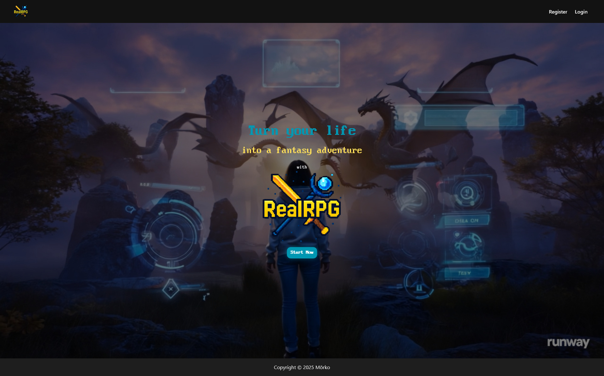
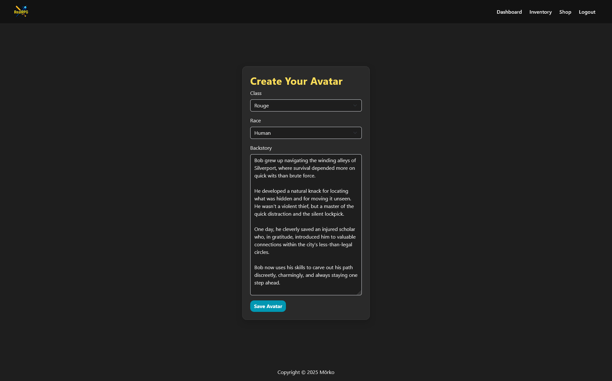
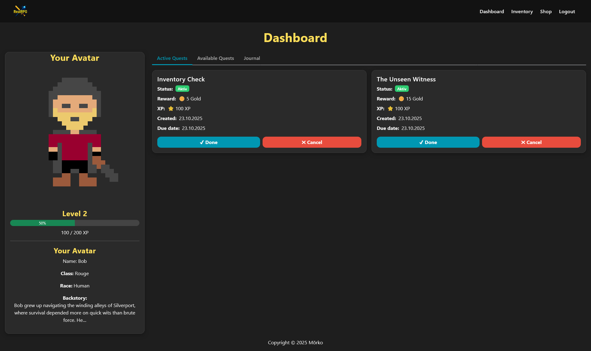
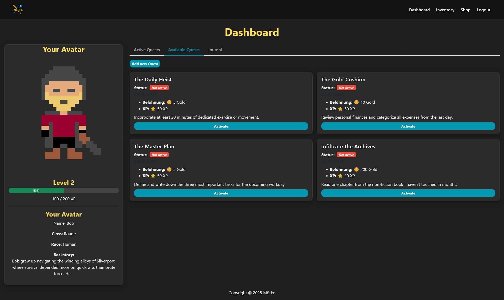
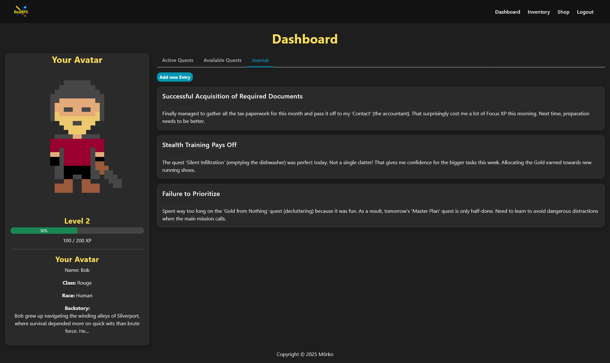
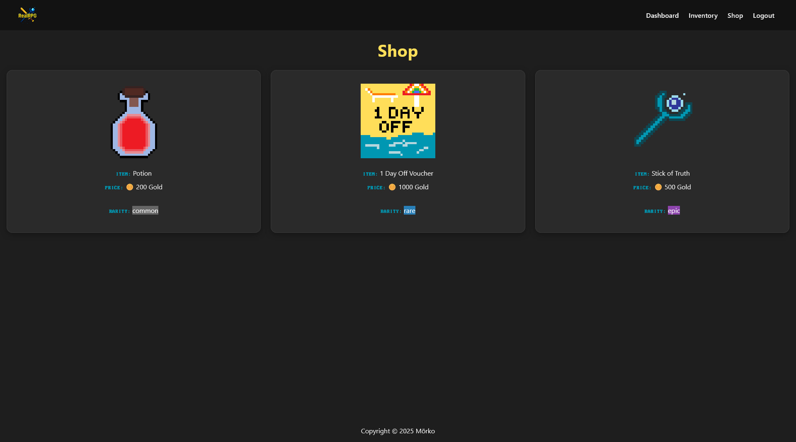
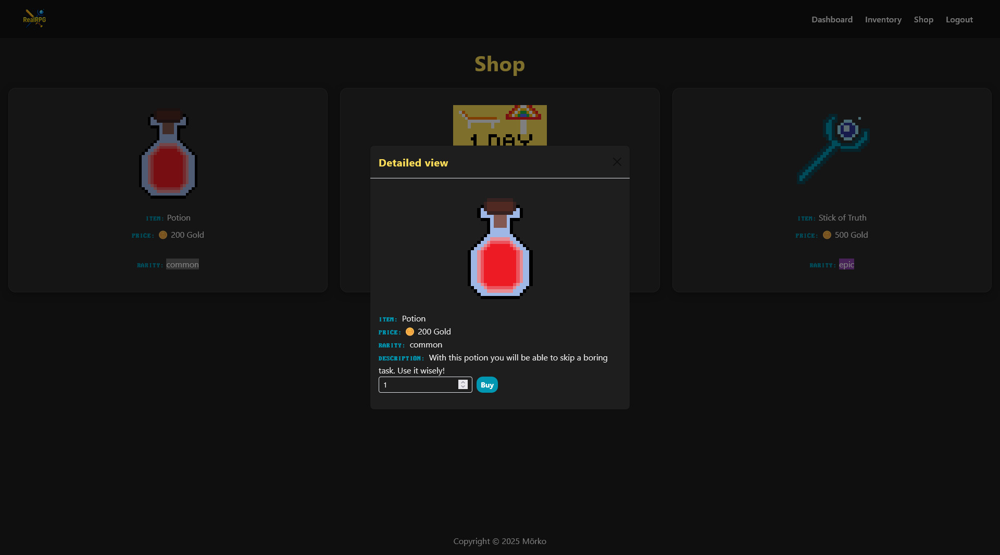
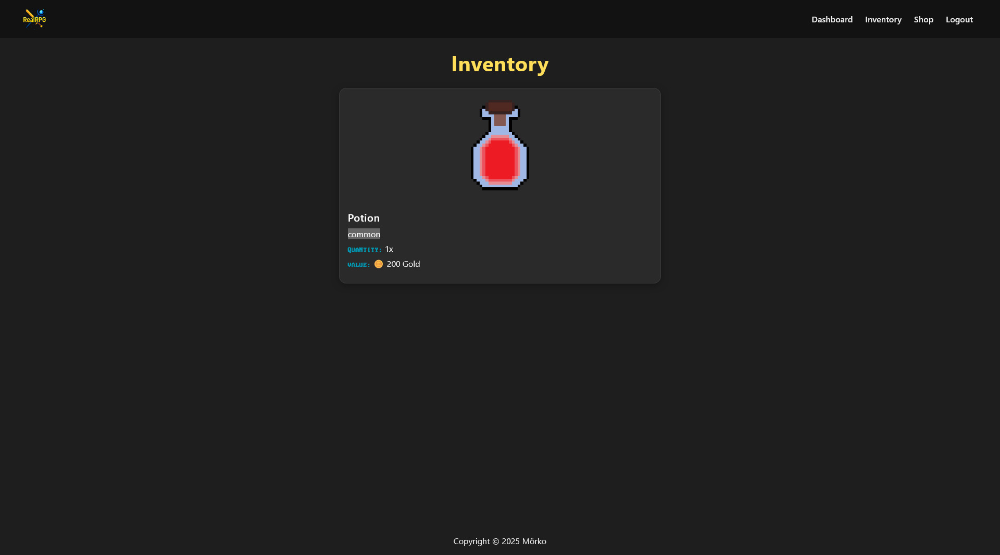
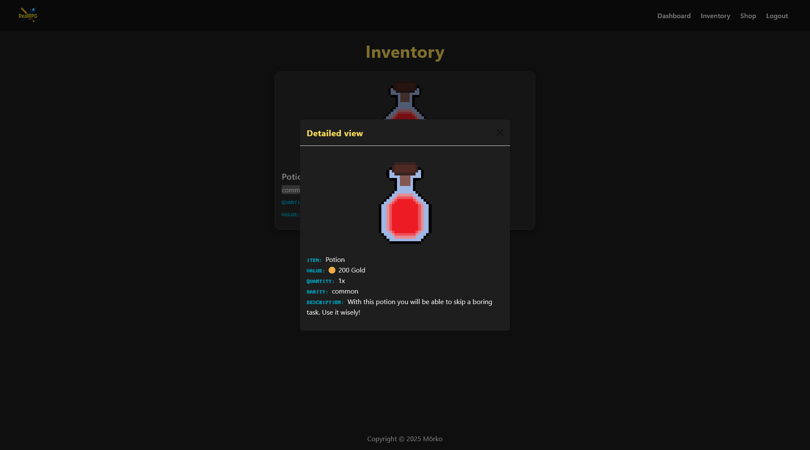

# 🧙‍♂️ RealRPG  
**Turn your life into a fantasy adventure**

---

## 🌱 About the Project

It all started as a simple **To-Do list experiment** just for fun.  
Then came the thought:  
> “What if I made it look more like a game?”

And then it *escalated*, fast.  

Now it’s a **RPG-style quest tracker** with characters, active quests, a level system, and a retro fantasy UI.  
It’s still growing, refactoring, and transforming, one quest at a time. ⚔️

---

## 🏗️ Current Status

> 🚧 **This project is still in active development.**  
> The current version is written in **vanilla PHP**, but a **Laravel migration** is already underway.  
> Some security improvements (like XSS prevention, CSRF tokens, and stronger input validation) will be part of that transition.  
> I’m aware that the current prototype is far from production-ready, it’s a playground for learning, experimenting, and improving.

---

## ⚙️ Features

- 🧾 User registration & login  
- 🗺️ Quest system (create, track, complete)  
- ⭐ Level & XP system  
- 💰 Gold economy  
- 🧙 Avatar creation (class, race, backstory)  
- 📜 Journal entries  
- 🛒 In-game Shop & Inventory  
- 🎞️ Animated hero video on homepage  
- 🎨 Retro-pixel design using custom fonts

---

## 🧩 Tech Stack

| Layer | Technology |
|-------|-------------|
| Backend | PHP (Vanilla, MVC-style) |
| Database | MySQL |
| Frontend | HTML, Bootstrap, Custom CSS |
| Planned Upgrade | Laravel 12 + TailwindCSS + Blade templates |

---

## 🧠 Philosophy

> “Real life is the ultimate RPG. You just need to see it that way.”

RealRPG gamifies everyday productivity by turning real-world tasks into quests, progress into XP, and self-growth into adventure.

---

## 🖼️ Screenshots

### 🏠 Homepage  

### 🧍‍♂️ Create Your Avatar  

### 🎯 Active Quests  

### 📋 Available Quests  

### 📔 Journal Entries  

### 💎 Shop  

### 🧴 Buy Item  

### 🎒 Inventory  

### 📦 Item Details  

---

## 🧾 Known Limitations & Roadmap

- [ ] Refactor backend into **Laravel**
- [ ] Implement **CSRF** & **XSS** protection
- [ ] Add user-specific item actions (use/sell)
- [ ] Introduce **daily quests** & streaks
- [ ] Add **achievement system**
- [ ] Integrate REST API for a future mobile version

---

## 🧙 Author

**Developed by:** [Mirko Rimac](https://github.com/MirkoRimac)  
🎨 Design, Code & Concept by a single dev who just wanted to make life a little more like a game.  

---

## ⚠️ Disclaimer

> This is not a production-grade app yet.  
> Some parts are messy. Some are fun. All are written with love and curiosity.

---
